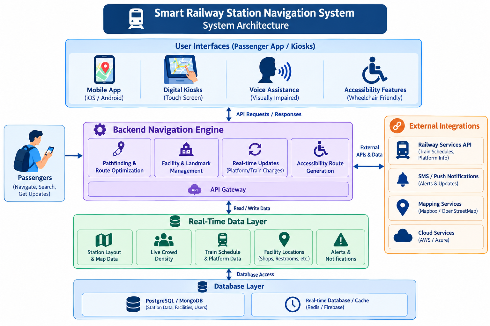
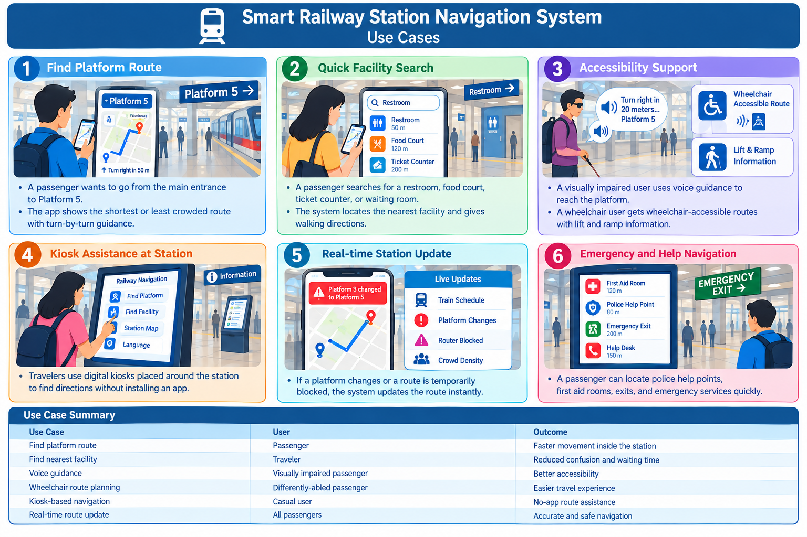

# Smart India Hackathon Workshop
# Date:  17-09-2026
## Register Number:  212225230025
## Name:  ASHWIN H
## Problem Title
SIH 1710: Enhancing Navigation for Railway Station Facilities and Locations
## Problem Description
Background: Railway stations are complex environments with numerous facilities and locations such as ticket counters, platforms, restrooms, food courts, and waiting areas. Passengers often face difficulties in navigating these spaces, especially in large or unfamiliar stations. Efficient and user-friendly navigation systems are crucial for improving passenger experience, reducing congestion, and ensuring timely travel connections. Description: The problem involves developing a comprehensive navigation solution for railway stations that assists passengers in locating various facilities and destinations within the station premises. This includes creating detailed maps, providing real-time directions, and integrating features such as accessibility options for individuals with disabilities. The solution should be intuitive, easy to use, and accessible via multiple platforms, including mobile devices and digital kiosks. Key challenges include updating navigation information in real-time, ensuring accuracy, and accommodating the diverse needs of all passengers. Expected Solution: The expected solution is a multi-platform navigation system that provides detailed, real-time directions to all facilities and locations within a railway station. This system should include: A mobile application with 3D interactive maps and step-by-step navigation. Digital kiosks located throughout the station with touch-screen interfaces. Voice-guided navigation for visually impaired passengers. Regular updates to reflect changes in station layout and facility locations. Integration with existing railway apps and services for seamless user experience. The solution should enhance the overall passenger experience by reducing confusion, saving time, and improving accessibility within the station.

## Problem Creater's Organization
Ministry of Railway

## Idea
The proposed idea is to build a Smart Railway Station Navigation System that helps passengers quickly reach ticket counters, platforms, restrooms, food courts, waiting areas, lifts, escalators, emergency exits, and other facilities inside the station. The system will provide indoor maps, route guidance, real-time updates, and accessibility features for passengers with special needs.

The solution will use digital maps, mobile-based navigation, digital kiosks, and voice assistance to reduce passenger confusion, save time, and improve movement inside crowded station premises.

## Proposed Solution / Architecture Diagram

## Use Cases
1. Passenger route navigation
   - A passenger wants to go from the main entrance to Platform 5.
   - The app shows the shortest or least crowded route with turn-by-turn guidance.

2. Quick facility search
   - A passenger searches for a restroom, food court, ticket counter, or waiting room.
   - The system locates the nearest facility and gives walking directions.

3. Accessibility support
   - A visually impaired user uses voice guidance to reach the platform.
   - A wheelchair user gets wheelchair-accessible routes with lift and ramp information.

4. Kiosk assistance at station
   - Travelers use digital kiosks placed around the station to find directions without installing an app.

5. Real-time station update
   - If a platform changes or a route is temporarily blocked, the system updates the route instantly.

6. Emergency and help navigation
   - A passenger can locate police help points, first aid rooms, exits, and emergency services quickly.

### Use Case 

## Technology Stack
- Frontend: Flutter / React Native / HTML5 for mobile and kiosk UI
- Backend: Node.js or Python (FastAPI/Django)
- Database: PostgreSQL / MongoDB
- Real-time Services: Firebase / Redis / WebSockets
- Mapping & Navigation: Mapbox / Leaflet / OpenStreetMap / custom indoor map engine
- Voice Assistance: Google Text-to-Speech / Speech API / accessibility modules
- Analytics: Python or JavaScript-based route analytics and crowd monitoring
- Deployment: AWS / Azure / Railway infrastructure hosting
- Security: JWT authentication, role-based access, secure APIs

## Dependencies
- Station floor plans and indoor map data
- Real-time train schedule and platform data
- Facility location and landmark database
- GPS / Wi-Fi / Bluetooth-based indoor positioning support
- SMS or push notification service
- Cloud hosting and storage services
- Voice recognition and text-to-speech libraries
- Accessibility support tools for visual and mobility assistance
- Railway app integration APIs, if available

